# lvm 使用手册

## lvm 概念
<div align=center></div> 

## 创建lv分区(/dev/xvg/xlv)
```bash
pvcreate /dev/vdc1  #创建pv
vgcreate xvg /dev/vdc1 #创建vg
lvcreate -L 100M -n xlv xvg #创建lv
```

## 销毁lv分区
```bash
lvremove /dev/xvg/xlv #销毁lv
vgremove xvg #销毁vg
pvremove /dev/vdc1  #销毁pv
```
