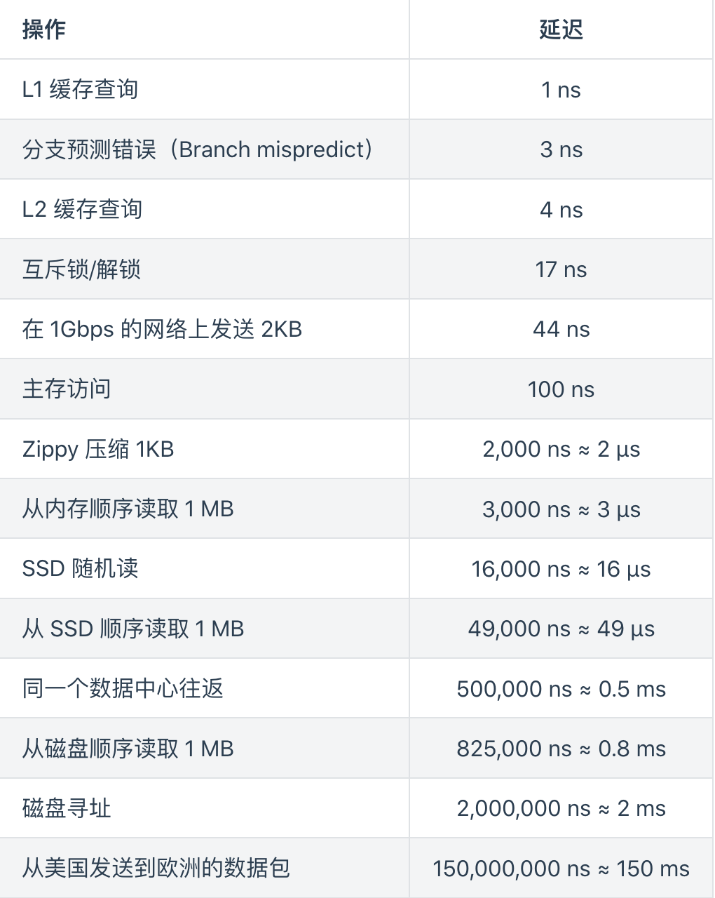

# Syscall

## 命名空间
```bash
chroot
nsenter -n -t ${PID}
# cgroup
# /sys/fs/cgroup/cpu
```

## 进程管理
```bash
# R(runing)/S(stop)/D(等待IO)/T(stop)/Z(zombie)
ps -ef
# jobs ->  bg(ctrl+z/&) -> fg 
kill -9 121 
# man 7 signal 
# 1(重新加载配置) 2(删内存) 3(删鼠标)
# 9(强删) 15(弱删)
# 18(启动) 19(强挂起) 20(弱挂起)
```

## 进程分析
```bash
pidstate #-r 
cd /proc/4795           #fd status stack //查看系统记录
pstack 4795             #查看进程栈
starce -p 4795          #查看系统调用
lsof -d 1               #通过fd进行查询进程
lsof -p 4795            #通过进程id查询fd
```

## 压测
```bash
stress --cpu 1 --timeout 60
stress --vm-bytes 100m --vm-keep -m 1
```

## 系统latency

