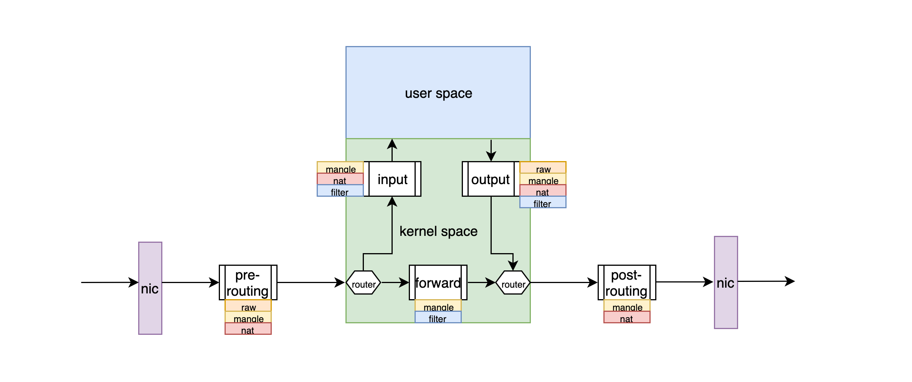

# net-kernel 知识

## Linux网络相关机制
### dpdk
完全 Kernel bypass
### xdp
半 Kernel bypass ---> BPF & eBPF
### netfilter & conntrack


## Linux系统网络参数
```bash
# 网络层
## 路由相关
net.ipv4.ip_forward = 1 #NAT网关开启IP转发
net.ipv4.ip_default_ttl = 64 #数据包的生存周期 TTL
net.ipv4.conf.eth0.rp_filter = 1 #数据包的反向地址校验, 防止IP欺骗
## 数据分片相关
## 内网开大mtu

# 传输层
# sysctl -a|grep net.ipv4.tcp
## tcp连接相关
net.ipv4.tcp_syn_retries = 2 #内网降低重试次数
net.ipv4.tcp_max_syn_backlog = 1024 #内网增大半连接队列
net.ipv4.tcp_syncookies = 1 #内网启用syncookies,不使用SYN队列建立连接
net.ipv4.tcp_synack_retries = 2 #内网降低SYN-ACK重试
net.core.somaxconn=1024 #内网增大全连接队列
net.ipv4.ip_local_port_range = 1024 65535 #内网增大端口范围
## tcp传输相关
## sysctl net.ipv4.tcp_available_congestion_control #查看拥塞算法
net.ipv4.tcp_congestion_control=bbr #bbr
# net.ipv4.tcp_keepalive_time #最大闲置时间
# net.ipv4.tcp_keepalive_intvl #内网增大发送探测包的时间间隔
# net.ipv4.tcp_keepalive_probes #最大失败次数，超过此值后将通知应用层连接失效
## tcp挥手相关
net.ipv4.tcp_orphan_retries = 5 #内网减小FIN重传次数
net.ipv4.tcp_max_orphans = 32768 #内网减小半连接最大数
net.ipv4.tcp_max_tw_buckets = 32768 #内网增大TIME_WAITE队列,减少不同连接间数据错乱的概率
```

## Socket 分类
<div align=center></div> 
