# lvm 使用手册

## lvm 概念
<div align=center></div> 

## 创建lv分区
```bash
parted # toggle 1 lvm #创建lvm分区
pvcreate /dev/vdc1  #创建pv
vgcreate xvg /dev/vdc1 #创建vg
lvcreate -L 100M -n xlv xvg #创建lv
```

## 格式化磁盘
```bash
mkfs.xfs /dev/xvg/xlv # 格式化磁盘
```

## 分区挂载与卸载
```bash
mkdir -p /mnt/xdisk
#新增/etc/fstab配置
#/dev/xvg/xlv /mnt/xdisk   xfs    defaults,noatime    0   0
mount -a #手动挂载

umount /mnt/xdisk #手动卸载
#删除/etc/fstab配置
```

## 销毁lv分区
```bash
lvremove /dev/xvg/xlv #销毁lv
vgremove xvg #销毁vg
pvremove /dev/vdc1  #销毁pv
```
